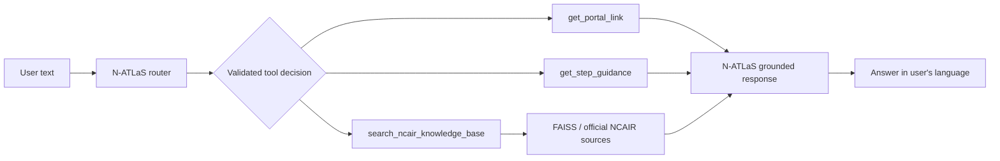

# NCAIR LMS Chatbot 2.0

A text-only multilingual assistant for NCAIR LMS questions. V1 preserves the original keyword router. V2 uses the official `NCAIR1/N-ATLaS` model for language understanding and structured tool selection, then executes the same three deterministic tools against official NCAIR evidence.

**Supported languages:** English · Hausa · Yoruba · Igbo

## Architecture

### V2 — assessed implementation



N-ATLaS normalizes Hausa, Yoruba, and Igbo knowledge questions into an English retrieval query. FAISS still searches the same official source material; the final response is generated from the returned evidence.

### V1 — comparison baseline

```text
User text
  -> keyword/sub-string router
  -> same three tool concepts
  -> FAISS for knowledge questions
  -> Ollama llama3.2:3b for grounded knowledge answers
```

The V1 router is deliberately preserved rather than improved so benchmark comparisons remain meaningful.

## Quick start

Requirements:

- Python 3.11+
- Poppler (`pdftoppm`)
- Tesseract OCR
- enough RAM/VRAM to run the 8B N-ATLaS model for real V2 inference
- Ollama only if you want full V1 answers

```bash
git clone https://github.com/Davemafy/ncair-lms-chatbot2.0.git
cd ncair-lms-chatbot2.0
cp .env.example .env
python -m venv .venv
# Windows: .venv\Scripts\activate
# macOS/Linux: source .venv/bin/activate
python -m pip install --upgrade pip
make install-dev
```

Without `make`:

```bash
python -m pip install -e ".[runtime,dev]"
```

## Configuration

`.env.example` documents every runtime setting and the application loads `.env` automatically. The defaults select `NCAIR1/N-ATLaS`, `TOP_K=3`, a `0.30` minimum retrieval similarity, and the original Ollama V1 model. `HF_TOKEN` has no default secret value and is optional for public model access.

Environment files are never committed.

## Run V1

Start Ollama first:

```bash
ollama pull llama3.2:3b
ollama serve
```

Then:

```bash
make run-v1
```

Raw command:

```bash
NCAIR_DEFAULT_VERSION=v1 uvicorn ncair_lms.api:app --reload
```

## Run V2

```bash
make run-v2
```

Raw command:

```bash
NCAIR_DEFAULT_VERSION=v2 uvicorn ncair_lms.api:app --reload
```

The first V2 request loads `NCAIR1/N-ATLaS`. Model loading is intentionally lazy so linting, unit tests, benchmark validation, and API import do not download the model.

Endpoints:

- `POST /api/v1/chat`
- `POST /api/v2/chat`
- `POST /api/chat` — uses `NCAIR_DEFAULT_VERSION`
- `GET /api/health`

Request:

```json
{"message":"Ina zan shiga LMS?"}
```

Successful response shape:

```json
{
  "answer": "...",
  "language": "hausa",
  "tool": "get_portal_link",
  "sources": ["Verified NCAIR portal registry"]
}
```

## Tests and code quality

```bash
make test
make lint
make worker-test
```

`make check` runs linting/format checks, benchmark validation, offline unit tests, and Worker tests.

Unit tests mock model boundaries. They do not require internet access, N-ATLaS weights, Ollama, Cloudflare, or private credentials.

Real-model smoke tests are opt-in:

```bash
make test-integration
```

## Benchmark

The held-out benchmark contains exactly 60 questions: 15 each in English, Hausa, Yoruba, and Igbo.

Category totals:

| Category | Records |
| --- | ---: |
| navigation | 10 |
| step_guidance | 10 |
| documented_policy | 20 |
| trap | 12 |
| undocumented | 8 |

Validate the dataset without model inference:

```bash
make benchmark-validate
```

Run routing comparisons:

```bash
make benchmark-old
make benchmark-new
```

Run the full answer path when both model runtimes are available:

```bash
python -m eval.run_benchmark --version v1 --mode full
python -m eval.run_benchmark --version v2 --mode full
```

Results are written to `eval/results/` and intentionally ignored by Git. The repository does **not** commit fabricated N-ATLaS scores. Generate results on hardware that can actually load the model, then review the output before reporting it.

Metrics include tool accuracy, deterministic-argument accuracy, per-language routing accuracy, language accuracy, trap accuracy, undocumented-question safety, evidence-hit rate, cross-language tool consistency, failure rate, and latency.

## Project structure

```text
.
├── data/                         # official NCAIR source material
├── eval/                         # held-out benchmark + evaluation code
├── src/
│   └── ncair_lms/
│       ├── api.py                # HTTP boundary
│       ├── config.py             # environment configuration
│       ├── models.py             # shared domain models/enums
│       ├── natlas.py             # N-ATLaS adapter + V2 structured router
│       ├── rag.py                # lazy OCR/embedding/FAISS retrieval
│       ├── service.py            # V1/V2 orchestration
│       ├── tools.py              # canonical deterministic tools
│       └── v1_router.py          # preserved keyword baseline
├── tests/
│   ├── unit/
│   └── integration/
├── web/                          # existing static UI
└── worker/                       # legacy Cloudflare demo runtime
```

## V1 vs V2

| Concern | V1 | V2 |
| --- | --- | --- |
| Router | keyword/sub-string rules | N-ATLaS semantic structured routing |
| Languages | English-oriented baseline | English, Hausa, Yoruba, Igbo |
| Tools | same three concepts | same three canonical tools |
| Knowledge | FAISS official evidence | FAISS official evidence |
| Knowledge query | original user text | English normalized query |
| Answer model | local Ollama | N-ATLaS |
| Evaluation purpose | baseline | assessed implementation |

## Evaluation methodology

The benchmark is data, not prompt material. Router prompts do not contain benchmark examples.

For each record the evaluator compares the selected tool, deterministic arguments, detected language, whether official evidence was found, and failures. Cross-language consistency is measured only for records sharing a `semantic_key`.

`routing` mode stops after tool execution. `full` mode additionally generates the answer.

## Actual results

No full N-ATLaS result file is committed because this repository cannot truthfully claim a score without running the 8B model. The evaluation path is reproducible and `eval/results/` is reserved for real run output.

This is preferable to checking in mock or fabricated scores.

## Deployment

The `worker/` directory is the pre-existing Cloudflare Workers AI demo. It uses a Cloudflare-hosted GLM model and is retained so the deployed demo does not disappear. It is **not** the assessed N-ATLaS V2 and must not be reported as such.

The Python V2 is the source of truth for assignment evaluation.

## Limitations

- N-ATLaS is an 8B model; first-run download and inference need appropriate hardware.
- PDF ingestion depends on system-installed Poppler and Tesseract.
- FAISS uses an English embedding model, so V2 deliberately asks N-ATLaS for an English retrieval query before search.
- The current static Vercel UI points at the legacy Worker deployment; use the Python API endpoints for assessed V1/V2 evaluation.
